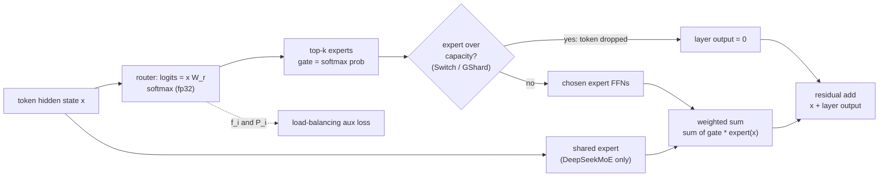

# MoE reproduced: Switch Transformer and DeepSeekMoE from scratch

A small-scale, from-scratch PyTorch reproduction of the mixture-of-experts (MoE) mechanisms of **Switch Transformer** and **DeepSeekMoE**, with GShard top-2 as a baseline, plus a hardware and systems characterization (roofline analysis, dispatch profiling and an analytical expert-placement model). Five model variants are trained at matched activated compute on TinyStories and analysed with six experiments (E1 to E6) and an 8-page Streamlit dashboard. Everything ran on a single **RTX 5070 Ti Laptop GPU** (12 GB, Blackwell) under WSL2/Ubuntu. The scale is small (13.8M active / 63M total parameters, 49.2M training tokens), so read the numbers as qualitative evidence, not as a replication of the papers' absolute results.

Code licensed under the [MIT License](LICENSE). The methods themselves belong to the cited paper authors (see [Credits and attribution](#credits-and-attribution)); the TinyStories dataset is distributed under its own terms on Hugging Face.

## Contents

1. [Credits and attribution](#credits-and-attribution)
2. [What this project does](#what-this-project-does)
3. [How training works](#how-training-works)
4. [Experiments](#experiments)
5. [Results](#results)
6. [Dashboard and report](#dashboard-and-report)
7. [Reproduce it](#reproduce-it)
8. [Repository map](#repository-map)
9. [Troubleshooting](#troubleshooting)

## Credits and attribution

**This is an independent educational reproduction. It is not affiliated with, or endorsed by, the authors of any paper listed here. All ideas belong to the cited authors; any errors in this code, in the experiments or in this write-up are the repo author's.**

Papers whose mechanisms are implemented:

| work | authors | venue / year | link |
|---|---|---|---|
| **Switch Transformers: Scaling to Trillion Parameter Models with Simple and Efficient Sparsity** | William Fedus, Barret Zoph, Noam Shazeer | JMLR 23(120):1-39, 2022 (arXiv 2021) | [arXiv:2101.03961](https://arxiv.org/abs/2101.03961) |
| **DeepSeekMoE: Towards Ultimate Expert Specialization in Mixture-of-Experts Language Models** | Damai Dai, Chengqi Deng, Chenggang Zhao, R.X. Xu, Huazuo Gao, Deli Chen, Jiashi Li, Wangding Zeng, Xingkai Yu, Y. Wu, Zhenda Xie, Y.K. Li, Panpan Huang, Fuli Luo, Chong Ruan, Zhifang Sui, Wenfeng Liang | arXiv, 2024 | [arXiv:2401.06066](https://arxiv.org/abs/2401.06066) |
| **GShard: Scaling Giant Models with Conditional Computation and Automatic Sharding** (the top-2 baseline) | Dmitry Lepikhin, HyoukJoong Lee, Yuanzhong Xu, Dehao Chen, Orhan Firat, Yanping Huang, Maxim Krikun, Noam Shazeer, Zhifeng Chen | arXiv, 2020 | [arXiv:2006.16668](https://arxiv.org/abs/2006.16668) |
| **Outrageously Large Neural Networks: The Sparsely-Gated Mixture-of-Experts Layer** (the original sparse MoE) | Noam Shazeer, Azalia Mirhoseini, Krzysztof Maziarz, Andy Davis, Quoc Le, Geoffrey Hinton, Jeff Dean | arXiv, 2017 | [arXiv:1701.06538](https://arxiv.org/abs/1701.06538) |

Dataset, components and the analytical bridge:

| work | authors | venue / year | link |
|---|---|---|---|
| **TinyStories: How Small Can Language Models Be and Still Speak Coherent English?** (the dataset) | Ronen Eldan, Yuanzhi Li | arXiv, 2023 | [arXiv:2305.07759](https://arxiv.org/abs/2305.07759); data: Hugging Face [`roneneldan/TinyStories`](https://huggingface.co/datasets/roneneldan/TinyStories) |
| **RoFormer: Enhanced Transformer with Rotary Position Embedding** (RoPE) | Jianlin Su, Yu Lu, Shengfeng Pan, Ahmed Murtadha, Bo Wen, Yunfeng Liu | arXiv, 2021 | [arXiv:2104.09864](https://arxiv.org/abs/2104.09864) |
| **Root Mean Square Layer Normalization** (RMSNorm) | Biao Zhang, Rico Sennrich | NeurIPS 2019 | [arXiv:1910.07467](https://arxiv.org/abs/1910.07467) |
| **WSC-LLM: Efficient LLM Service and Architecture Co-exploration for Wafer-scale Chips** | Zheng Xu et al. | ISCA 2025 | [doi:10.1145/3695053.3731101](https://doi.org/10.1145/3695053.3731101) |

WSC-LLM is **not reproduced**. It is cited only as the motivation for the analytical expert-placement model in E6, which is a toy version of the compute / memory / communication trade-off such wafer-scale designs explore.

**Software:** [PyTorch](https://pytorch.org), Hugging Face [`datasets`](https://github.com/huggingface/datasets) and [`tokenizers`](https://github.com/huggingface/tokenizers), [Streamlit](https://streamlit.io), [Plotly](https://plotly.com/python/), [NumPy](https://numpy.org), [pandas](https://pandas.pydata.org).

**How this was built.** The code was written with AI pair-programming assistance (Claude Code): an Opus "architect" agent handled the routing math, tests, profiling methodology and the placement model, and a Sonnet "builder" agent handled plumbing (data loading, training loop, scripts, docs). The agent definitions are in `.claude/agents/` and the hand-off log is `PROGRESS.md`. The original task specification is not included in this repository; references to "MASTER §…" or `MASTER_PROMPT.md` in code comments and docs point to sections of that private spec (the relevant requirements are restated in `docs/PLAN.md`, `docs/CONFIG_SCHEMA.md` and `docs/DASHBOARD_SPEC.md`). Every number in this repo was produced by actual runs on the author's hardware; none is typed in by hand (the report and dashboard compute them from files in `results/`).

BibTeX for the two main papers:

```bibtex
@article{fedus2022switch,
  title   = {Switch Transformers: Scaling to Trillion Parameter Models with Simple and Efficient Sparsity},
  author  = {Fedus, William and Zoph, Barret and Shazeer, Noam},
  journal = {Journal of Machine Learning Research},
  volume  = {23},
  number  = {120},
  pages   = {1--39},
  year    = {2022},
  url     = {https://arxiv.org/abs/2101.03961}
}

@article{dai2024deepseekmoe,
  title   = {DeepSeekMoE: Towards Ultimate Expert Specialization in Mixture-of-Experts Language Models},
  author  = {Dai, Damai and Deng, Chengqi and Zhao, Chenggang and Xu, R.X. and Gao, Huazuo and Chen, Deli and Li, Jiashi and Zeng, Wangding and Yu, Xingkai and Wu, Y. and Xie, Zhenda and Li, Y.K. and Huang, Panpan and Luo, Fuli and Ruan, Chong and Sui, Zhifang and Liang, Wenfeng},
  journal = {arXiv preprint arXiv:2401.06066},
  year    = {2024}
}
```

## What this project does

**Mixture of experts.** A dense transformer runs every token through one feed-forward network (FFN). An MoE layer replaces that FFN with many smaller "expert" FFNs and a learned **router**; each token is sent to only a few experts. Total parameters grow with the number of experts, but the compute per token stays roughly constant because only the chosen experts run.

**One token's path through an MoE layer:**



In words: router, top-k, experts, weighted sum, residual.

- **Router and top-k.** The router is a linear map from the hidden state to one logit per expert, followed by a softmax. The k highest-probability experts are chosen (k = 1 for Switch, 2 for GShard, 3 routed experts for DeepSeekMoE). The gate value is the raw softmax probability (not renormalized, as in both papers).
- **Capacity factor and token dropping.** For efficient batched execution each expert gets a fixed number of slots: capacity = tokens per batch / experts x capacity factor (top-k variants scale this by k). Tokens routed to a full expert are **dropped**: the layer returns zero for them and they pass through only the residual connection. A higher capacity factor drops fewer tokens but wastes more padded compute and memory (E2). DeepSeekMoE keeps all experts on one device and never drops.
- **Load-balancing auxiliary loss.** Left alone, routers collapse onto a few favourite experts. Switch adds `alpha * N * sum_i f_i * P_i`, where `f_i` is the fraction of tokens sent to expert i (not differentiable) and `P_i` the mean router probability for expert i (differentiable); it is minimal when routing is uniform. DeepSeekMoE uses the analogous expert-level loss. Here alpha = 0.01.
- **fp32 router.** Under bf16 autocast the experts run in bf16, but the router logits and softmax are computed in fp32 (Switch's "selective precision"), because rounding in the router can flip expert choices and destabilise training. A test checks this.
- **Fine-grained experts and the shared expert (DeepSeekMoE).** Instead of 8 large experts, split each into m = 4 smaller ones (31 routed experts of width d_ff/4) and activate 4x as many (top-3 routed), which allows many more expert combinations per token. One additional **shared expert** is always on, with no gate, so common knowledge need not be duplicated across routed experts.

Variants, all with the same total expert parameters (8x a dense FFN) and the same activated FFN compute per token as the dense baseline (expert-FFN FLOPs; see `RESULTS.md` for the measured table):

| variant | experts | expert width | activated per token |
|---|---|---|---|
| `dense` | 1 | 1536 | 1 |
| `switch` | 8 routed | 1536 | top-1 |
| `gshard` | 16 routed | 768 (d_ff/2) | top-2 |
| `deepseek` | 1 shared + 31 routed | 384 (d_ff/4) | shared + top-3 |
| `dense_x8` | 1 | 12288 (8 x d_ff) | 1 (active compute is 8x by design; an upper-bound reference) |

Every layer's FFN is replaced by the variant's FFN. Each MoE layer has a readable per-expert **loop** dispatch and a **batched** dispatch; tests check that they produce the same outputs and gradients. The full study guide, with plain-language explanations, paper equations and the file and function that implements each, is [`NOTES.md`](NOTES.md).

## How training works

All values below are from `configs/main.yaml`.

- **Data.** TinyStories (Hugging Face `datasets`) -> a byte-level BPE tokenizer with vocabulary 8192, trained on 200,000 stories with Hugging Face `tokenizers` -> pre-tokenized `uint16` arrays cached in `data_cache/` (up to 60M train tokens, 2M validation tokens). If the download fails, data loading falls back to Tiny Shakespeare. The validation split is fixed.
- **Model.** Decoder-only, pre-norm: 6 layers, d_model 384, 6 heads, sequence length 256, d_ff 1536, RoPE positions (base 10000), RMSNorm (eps 1e-6), tied input/output embeddings. Initialization is a truncated normal with sigma = sqrt(0.1 / fan_in) (Switch's reduced init scale) for all variants.
- **Identical budget for every variant.** 6000 steps x 8192 tokens per step (batch 32 x 256) = 49.2M tokens, within the cached 60M, so no data is repeated. The data stream is a pure function of (seed, step), so every variant sees the same batches in the same order for a given seed.
- **Optimizer.** AdamW, betas (0.9, 0.95), weight decay 0.1 (matrices only, not norms, embeddings or routers), gradient clipping 1.0.
- **LR schedule.** Linear warmup for 200 steps to a peak of 2e-3, then multiplied by 0.316 at 80% and again at 90% of the steps (steps 4800 and 5400).
- **How the peak LR was chosen.** A pre-registered 3-point check on the small config (dense and Switch, peak LR in {5e-4, 1e-3, 2e-3}, seed 1337); the rule "pick the LR with the lowest mean validation loss over the two variants, then use it for all variants on main" was fixed before running. Mean val loss was 2.172 / 2.027 / 1.980, so 2e-3 won. Caveat: it is at the edge of the grid, and the grid was deliberately not extended (that would be tuning). One LR is shared by all variants, which likely disadvantages `dense_x8` (see E1 below).
- **Loss.** Total loss = cross-entropy + the sum of the aux losses over MoE layers. CE and aux are logged separately.
- **Precision.** bf16 autocast with an fp32 router. The device is auto-detected (CUDA, then MPS, then CPU) and recorded in each run's `env.json`.
- **Logging.** Each run writes to `results/<experiment>/<run_id>/`: resolved `config.json`, `env.json`, `train_log.jsonl` (every step), `eval_log.jsonl` (every 150 steps, 20 validation batches), `routing_log.jsonl` (every 50 steps), `final.json`.
- **Checkpoint and resume.** A checkpoint every 500 steps; a stopped run resumes from its last checkpoint with an identical data stream and RNG state.
- **Non-finite-gradient guard.** A step whose gradients are not finite is skipped instead of poisoning the weights. (The dense_x8 diagnosis recorded no skipped steps.)
- **Seeds.** Seed 1337 for all five variants; a second seed, 1338, for dense, Switch and DeepSeekMoE. GShard and dense_x8 have a single seed.

## Experiments

- **E1: variants at matched activated compute.** Trains dense, Switch, GShard-style top-2, DeepSeekMoE and dense_x8 on the same token budget and compares validation loss, throughput and peak memory. Mirrors the DeepSeekMoE comparison against GShard and a dense upper bound, and the Switch-versus-dense headline.
- **E2: capacity-factor sweep.** Switch at capacity factor 0.75, 1.0, 1.25 and 2.0: validation loss, token-drop rate, throughput and memory versus capacity. Mirrors the capacity trade-off in Switch Table 1 and Sec. 2.2.
- **E3: expert redundancy (eval-time).** On trained checkpoints, disable the top-r routed experts per token and measure the loss increase. Mirrors DeepSeekMoE Fig. 4.
- **E4: shared expert and k sweep (eval-time).** Disable DeepSeekMoE's shared expert (same k, or one extra routed expert) and sweep the number of routed experts k at evaluation. Mirrors DeepSeekMoE Sec. 4.5 and Fig. 5. These are eval-time changes to a trained model, not retraining.
- **E5: single-layer systems profile.** Microbenchmarks one FFN or MoE layer (loop versus batched dispatch, forward and forward+backward, 1K to 64K tokens), a phase time breakdown, and a roofline with a measured and a spec ceiling. Not a paper figure; it is the hardware-facing part.
- **E6: expert placement model.** An analytical model (not a simulator) that places experts on 2, 4 or 8 devices using real routing traces and reports device straggler slowdown, all-to-all bytes and an estimated step time. It is a toy bridge to the compute / memory / communication trade-off studied in WSC-LLM; see `docs/E6_NOTE.md`.

## Results

Main config, one RTX 5070 Ti Laptop GPU. The tables below are copied from `RESULTS.md`, which is auto-generated by `scripts/make_report.py`; see `RESULTS.md` for the source files behind every number.

### Headline numbers

| quantity | value |
|---|---|
| best MoE vs dense, final val loss (MoE minus dense, nats) | -0.050 (deepseek 1.658 vs dense 1.708; n seeds 2/2) |
| loop to batched dispatch speedup (loop ms / batched ms) at the training tokens per step, and its range over the token sweep | switch fwd: 1.46x at N=8,192 (training size); range 0.89x (N=65,536) to 2.86x (N=1,024); switch fwd_bwd: 1.90x at N=8,192 (training size); range 1.00x (N=65,536) to 4.16x (N=1,024); gshard fwd: 1.74x at N=8,192 (training size); range 0.98x (N=65,536) to 3.85x (N=1,024); gshard fwd_bwd: 2.62x at N=8,192 (training size); range 1.19x (N=65,536) to 6.08x (N=1,024); deepseek fwd: 2.91x at N=8,192 (training size); range 1.10x (N=65,536) to 5.91x (N=1,024); deepseek fwd_bwd: 4.11x at N=8,192 (training size); range 1.76x (N=65,536) to 8.15x (N=1,024) |
| Switch token drop rate at each capacity factor | cf=0.75: val 25.2%, train(last 10%) 25.0%; cf=1: val 5.1%, train(last 10%) 3.2%; cf=1.25: val 0.2%, train(last 10%) 0.0%; cf=2: val 0.0%, train(last 10%) 0.0% |
| straggler slowdown at D=8 (max device load / mean, all layers) | deepseek greedy: 1.149x; deepseek round_robin: 1.187x; gshard greedy: 1.129x; gshard round_robin: 1.251x; switch greedy: 1.203x; switch round_robin: 1.203x |

### E1: quality, throughput and memory

| variant | seeds | final val loss | ± half-range | val ppl | delta vs dense | train CE (last 5%) | median tok/s | peak memory |
|---|---|---|---|---|---|---|---|---|
| dense | 2 | 1.708 | 0.002 | 5.52 | +0.000 | 1.773 | 201k tok/s | 2,005 MiB |
| Switch (top-1) | 2 | 1.704 | 0.001 | 5.50 | -0.004 | 1.767 | 126k tok/s | 3,087 MiB |
| DeepSeekMoE (1+31, top-3) | 2 | 1.658 | 0.002 | 5.25 | -0.050 | 1.723 | 110k tok/s | 5,809 MiB |
| GShard (16 experts, top-2) | 1 | 1.678 | — | 5.36 | -0.030 | 1.737 | 109k tok/s | 3,135 MiB |
| dense ×8 | 1 | 1.678 | — | 5.36 | -0.030 | 1.740 | 71.9k tok/s | 4,809 MiB |

Per-seed final validation loss:

| group | n_seeds | s1337 | s1338 | spread (max-min) |
|---|---|---|---|---|
| dense | 2 | 1.706 | 1.710 | 0.004 |
| switch | 2 | 1.705 | 1.703 | 0.002 |
| deepseek | 2 | 1.660 | 1.656 | 0.004 |
| gshard | 1 | 1.678 | — | — |
| dense_x8 | 1 | 1.678 | — | — |

### E2: Switch capacity factor sweep (1 seed per point)

| capacity factor | capacity per expert C | seeds | val loss | delta vs cf=1.25 | val drop | train drop (last 10%) | median tok/s | peak memory |
|---|---|---|---|---|---|---|---|---|
| 0.75 | 768 | 1 | 1.838 | +0.133 | 25.2% | 25.0% | 132k tok/s | 2,926 MiB |
| 1 | 1,024 | 1 | 1.732 | +0.027 | 5.1% | 3.2% | 133k tok/s | 3,005 MiB |
| 1.25 | 1,280 | 1 | 1.705 | +0.000 | 0.2% | 0.0% | 125k tok/s | 3,087 MiB |
| 2 | 2,048 | 1 | 1.698 | -0.007 | 0.0% | 0.0% | 113k tok/s | 3,330 MiB |

### What replicated and what did not

Numbers below are from the tables above and `NOTES.md` ("What surprised me / what didn't replicate").

- **Replicated: DeepSeekMoE beats dense at matched compute.** Final val loss 1.658 vs 1.708 (-0.050 nats, mean of 2 seeds each). The seed spread (max - min) is 0.004 for both, so the gap is more than 10x the spread we measured; with 2 seeds this is a strong hint, not a confidence interval.
- **Replicated in direction: DeepSeekMoE < GShard < dense.** GShard (16 experts, top-2) reached 1.678 (-0.030 vs dense, 1 seed), matching the claim that fine-grained plus shared experts beat GShard-style top-2 at the same compute.
- **Did not replicate: Switch beating dense.** Switch 1.704 vs dense 1.708 (-0.004), which is the size of the dense seed spread (0.004): indistinguishable from dense at this scale. Untested possible reasons: tiny model and short training (0.78 training tokens per total parameter for the 63M-parameter models), only 8 experts, and an LR chosen on a proxy.
- **Did not replicate: dense_x8 as an upper bound.** Dense_x8 (all 63M parameters active) reached 1.678 (1 seed): tied with GShard and worse than DeepSeekMoE, the opposite of DeepSeekMoE's reported ordering. `docs/E1_DENSE_X8_NOTE.md` found no implementation bug; the likely cause is that one peak LR (2e-3) is too high for a 12,288-wide FFN (its output-projection weights moved 29x their initial norm, versus 13x for dense). Weak evidence either way.
- **Replicated: capacity-factor trade-off (E2).** Monotone: val loss 1.838, 1.732, 1.705, 1.698 and val drop rate 25.2%, 5.1%, 0.2%, 0.0% for cf 0.75, 1, 1.25, 2, with diminishing returns above 1.25 (cf 1.25 to 2 buys only -0.007 nats).
- **MoE is not free on one GPU.** Median training throughput: dense 201k tok/s, Switch 126k, DeepSeekMoE 110k, GShard 109k, dense_x8 71.9k. Peak memory: dense 2,005 MiB, Switch 3,087, GShard 3,135, DeepSeekMoE 5,809 (2.9x dense). Matched FLOPs do not mean matched wall-clock.
- **Direction replicated, magnitude did not (E3).** Disabling each token's top routed experts hurts DeepSeekMoE the most at every comparable fraction (+3.04 nats at 6.5% disabled vs GShard +2.33 at 6.2%), as in DeepSeekMoE Fig. 4, but every curve is a cliff followed by a plateau, so this only weakly orders the variants.
- **Replicated: the shared expert matters (E4).** Removing it costs +0.340 nats; removing it and activating one more routed expert still costs +0.328. This measures a model trained with a shared expert losing it, not a model trained without one.
- **Systems (E5).** Batched dispatch beat the per-expert loop at the training size (N = 8,192 tokens) by 1.46x (Switch), 1.74x (GShard) and 2.91x (DeepSeekMoE) in the forward pass, but the gain shrinks with N (0.89x for Switch at N = 65,536). Measured peak: 57.3 TFLOP/s bf16 GEMM and 481.5 GB/s copy; the best layer (the dense FFN) reached 38.2 TFLOP/s (67% of measured peak), while the MoE layers reached 6.1 to 9.3 TFLOP/s forward. The data suggest that small expert GEMMs, data movement and launch overhead dominate rather than DRAM bandwidth.
- **Placement (E6, analytical).** Straggler slowdown at D = 8 is 1.13x to 1.25x, and greedy placement reduces GShard's from 1.251x to 1.129x. For Switch at D = 8 the two policies are identical (1.203x): 8 experts on 8 devices leaves nothing to place.

**Limitations.**

- Small scale: 6 layers, d_model 384, 13.8M active / 63M total parameters, 49.2M training tokens. The papers train far larger models on far more data, and MoE gains are known to grow with scale.
- 1 to 2 seeds. Differences of a few thousandths of a nat are within noise; GShard and dense_x8 have no seed spread.
- E3 and E4 are eval-time ablations of one trained checkpoint per variant, not retrained models.
- A single laptop GPU with variable power states: throughput and timing can change by large factors. One E2 run and one E5 run were superseded for this reason (kept in `results/main/_superseded/`). E1 and E2 tokens/s are wall-clock and indicative only; E5 is the controlled measurement.
- E6 is analytical (no topology, overlap or contention), and no real multi-GPU expert parallelism was run.
- The spec bf16 peak (62 TFLOP/s) is derived from NVIDIA's published figures rather than printed in a spec, so treat it as approximate. The measured peak is 57.3 TFLOP/s.
- One peak LR is shared by all variants and was chosen on the small config.

## Dashboard and report

```bash
make dashboard
```

Open http://localhost:8501 (from the Windows browser if you run under WSL2). It reads `results/` and has 8 pages:

1. **Overview**: project summary, hardware, parameter/FLOP table and headline numbers.
2. **Training**: loss curves, aux loss, throughput and memory, seed spread.
3. **Routing**: expert-load heatmaps, load imbalance, router entropy and drop fraction.
4. **Capacity sweep (E2)**: val loss, drop rate and throughput versus capacity factor.
5. **Ablations (E3/E4)**: disabled-expert curves, shared-expert ablation, k sweep.
6. **Systems profile (E5)**: latency versus tokens, time breakdown, achieved TFLOP/s, roofline.
7. **Expert placement (E6)**: device load, straggler slowdown, all-to-all bytes, step-time estimate.
8. **How it works**: type a sentence, run it through a trained checkpoint and see each token's expert choices per layer (needs checkpoints).

`results/main/report.html` is a self-contained static report (plots embedded). GitHub does not render HTML, so download the file and open it in a browser. `RESULTS.md` has the same tables in markdown.

## Reproduce it

### Install

Requires WSL2 Ubuntu with the NVIDIA driver installed on the Windows side (do not install drivers inside WSL). Check the GPU is visible:

```bash
nvidia-smi
```

Create the venv. If `python3 -m venv .venv` works on your machine, use that (`make setup` does exactly that). If the `python3-venv`/ensurepip package is missing and you have no sudo, create the venv without pip and bootstrap pip (this was needed on the author's machine with Python 3.14):

```bash
cd ~/moe-repro          # or <repo>
python3 -m venv --without-pip .venv
curl -sS https://bootstrap.pypa.io/get-pip.py -o get-pip.py
.venv/bin/python get-pip.py
```

Install torch first, from the CUDA 12.8 index (Blackwell/sm_120 needs cu128 or newer), then the rest:

```bash
.venv/bin/pip install torch==2.11.0 --index-url https://download.pytorch.org/whl/cu128
.venv/bin/pip install -r requirements.txt
```

Verify (needs `True`, your GPU name, and `sm_120` in the arch list):

```bash
.venv/bin/python -c "import torch; print(torch.__version__, torch.version.cuda, torch.cuda.is_available(), torch.cuda.get_device_name(0), torch.cuda.get_arch_list())"
```

Commands use `.venv/bin/python` (the Makefile's `PY` variable; override with `make PY=python ...`). Before any long GPU run on a laptop: plug in, use the maximum-performance power mode, make sure the dGPU is not in an eco mode, and close other GPU apps.

### Run

```bash
make test      # unit tests
make smoke     # whole pipeline on CPU with configs/smoke.yaml (tiny model)
make all       # the full main pipeline
```

`make all` is `make main sweep ablate trace placement profile report`. One target per experiment, all using `configs/main.yaml`:

| experiment | make target | script |
|---|---|---|
| data (download, tokenize, cache) | `make data` | `moe/data.py` |
| E1: variants at matched activated compute | `make main` | `scripts/run_main.py` (5 variants with seed 1337, then dense/switch/deepseek with seed 1338; `--skip-existing`) |
| E2: capacity-factor sweep | `make sweep` | `scripts/sweep_capacity.py` |
| E3/E4: expert ablations (eval-time) | `make ablate` | `scripts/ablate_experts.py` |
| routing traces (input to E6) | `make trace` | `scripts/route_trace.py` |
| E6: expert placement model | `make placement` | `scripts/placement_sim.py` |
| E5: single-layer profiling and roofline | `make profile` | `scripts/profile_layer.py` |
| report (`RESULTS.md` + static HTML) | `make report` | `scripts/make_report.py` |

`--skip-existing` means re-running `make main` only does what is missing. `make trace` must run before `make placement`. Run `make profile` on an otherwise idle GPU. Other targets: `make small`, `make help`, `make clean-results`.

### What is not in the repository

Excluded for size or because they are regenerable: model checkpoints (`*.pt`), the tokenized data cache (`data_cache/`), routing traces (`results/*/traces/`) and profiler traces (`profiler_trace.json`). Regenerate them with `make data`, `make main` (checkpoints), `make trace` and `make profile`. The dashboard's "How it works" page and E3/E4 need checkpoints, so run `make main` first. `make report` and the other pages work from the committed result files.

### Expected run times (measured)

On the RTX 5070 Ti Laptop GPU, plugged in, main config (6 layers, d_model 384, 6000 steps, 49.2M tokens, bf16 autocast), from `wall_time_s` in each run's `final.json` and the chain-log timestamps. Laptop power states vary (one E2 run fell into a low-power state, 2158 s instead of about 400 s, and was re-run), so expect different times on other hardware.

| step | wall time | note |
|---|---|---|
| `make smoke` (CPU) | 153 s | full pipeline, tiny model |
| E1 dense | 265 s | 200k tok/s, 2.0 GB peak |
| E1 switch | 430 s | 125k tok/s, 3.1 GB peak |
| E1 deepseek | 493-495 s | 110k tok/s, 5,727–5,891 MiB peak |
| E1 gshard | 498 s | 109k tok/s, 3.1 GB peak |
| E1 dense_x8 | 725 s | 72k tok/s, 4.8 GB peak |
| E1 total (8 runs) | 3600 s (60 min) | sum of the 8 runs |
| E2 switch cf 0.75 / 1.0 / 2.0 | 496 / 404 / 474 s | cf 1.25 is reused from E1 |
| E3/E4 ablations | 56 s | |
| traces | 14 s | |
| E6 placement | 2 s | |
| E5 profiling | 182 s | full mode |
| report | 4 s | |
| whole chain (`make all`) | about 87 min | sum of the rows above, excluding data download |

### Resume an interrupted run

```bash
.venv/bin/python scripts/train.py --resume results/main/e1_main/<run_id>
.venv/bin/python scripts/train.py --config configs/main.yaml --variant switch --resume auto   # newest unfinished run of that variant and seed
```

### Watch training live

```bash
tail -f "$(ls -td results/main/e1_main/*/ | head -1)train_log.jsonl" | python3 -c "
import sys, json
for l in sys.stdin:
    r = json.loads(l)
    print(f\"step {r['step']:5d}  ce {r['ce_loss']:.3f}  {r['tokens_per_sec']/1e3:.0f}k tok/s\", flush=True)"
```

Change `e1_main` to `e2_capacity` etc. for other experiments.

## Repository map

| path | contents |
|---|---|
| `moe/` | model, routers, the MoE layers, data, FLOP/param counting, profiling helpers |
| `scripts/` | experiment entry points (`train.py`, `run_main.py`, `sweep_capacity.py`, `ablate_experts.py`, `route_trace.py`, `placement_sim.py`, `profile_layer.py`, `make_report.py`) |
| `configs/` | `smoke.yaml`, `small.yaml`, `main.yaml` |
| `tests/` | unit tests (`make test`) |
| `dashboard/` | Streamlit app, pages and figure builders |
| `results/` | run outputs; `results/main/_superseded/` holds replaced runs; `results/main/report.html` is the static report |
| `NOTES.md` | study guide: each concept, the paper equation, the code that implements it, what surprised me |
| `RESULTS.md` | generated tables and headline numbers |
| `docs/` | `PLAN.md`, `CONFIG_SCHEMA.md`, `DASHBOARD_SPEC.md`, `E6_NOTE.md`, `E1_DENSE_X8_NOTE.md` |
| `PROGRESS.md`, `.claude/agents/` | hand-off log and agent definitions |
| `LICENSE` | MIT license for the code |

## Troubleshooting

- **Out of memory (CUDA OOM).** Shrink in `configs/main.yaml`: `train.batch_size` first (peak memory scales with it), then `model.seq_len`, then `model.d_model` / `model.d_ff`, or run fewer variants (`--variants dense switch`). The most memory-hungry variants are DeepSeek (5,727–5,891 MiB peak) and dense_x8 (4.8 GB); dense uses 2.0 GB, Switch and GShard about 3.1 GB. Check what else uses the GPU with `nvidia-smi`.
- **"sm_120 is not compatible"** (or `is_available()` is False). The wrong torch build is installed (CPU-only or older CUDA). Reinstall with the cu128 command above.
- **GPU much slower than expected, or memory clock stuck at 810 MHz.** Plug in, use the maximum-performance power mode, and make sure the dGPU is not in an eco mode. Inspect with `nvidia-smi --query-gpu=clocks.sm,clocks.mem,temperature.gpu,power.draw --format=csv`. The E5 profile output carries `power_state_changed` / `low_power_state` flags; do not trust E5 timings on rows flagged `low_power_state`. A throughput drop of several times during a run (`tokens_per_sec` in the train log) means a low-power state; re-run that run.
- **Another app is using the GPU.** This happened during the project (a Windows-side app at 93% utilisation with no WSL process). Close it and recheck `nvidia-smi` before timing anything; profiling flags `gpu_busy_before_run`.
- **`power.limit` reads N/A.** Normal under WSL; the field is stored as null.
- **Hugging Face download fails.** Data loading falls back to Tiny Shakespeare (recorded in the run's config). To retry TinyStories, delete `data_cache/` and run `make data`.
- **Streamlit asks for an e-mail on first start.** `make dashboard` passes `--server.headless true --browser.gatherUsageStats false` to avoid that prompt.
